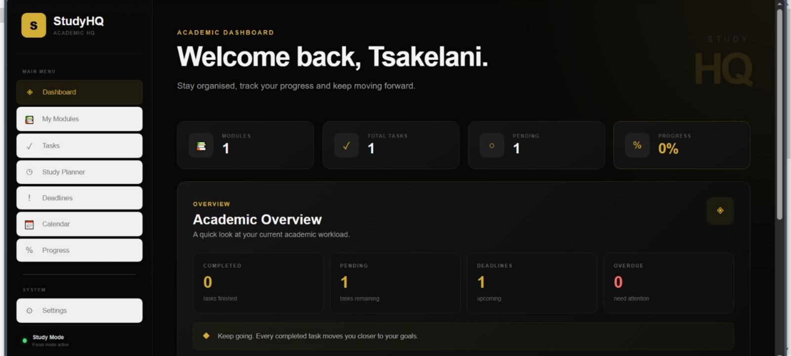
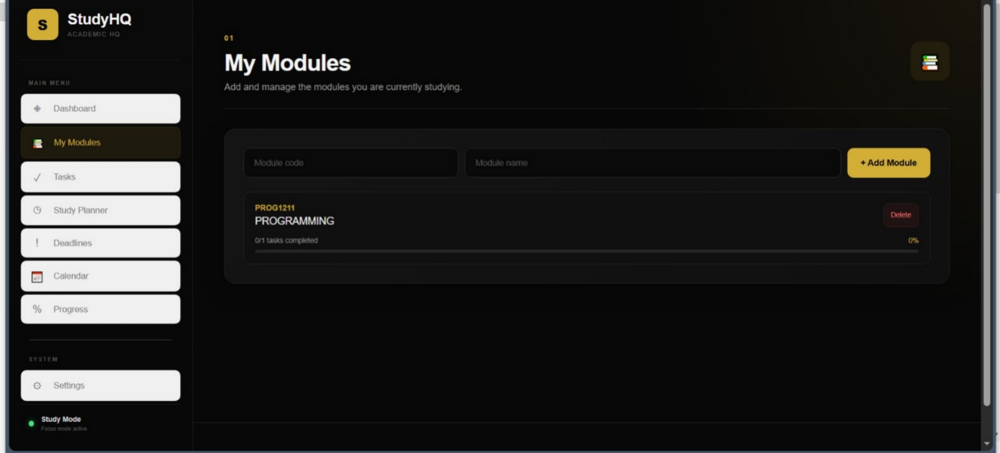
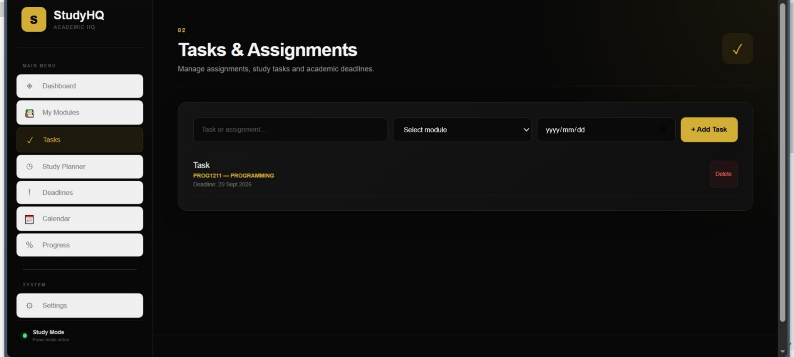
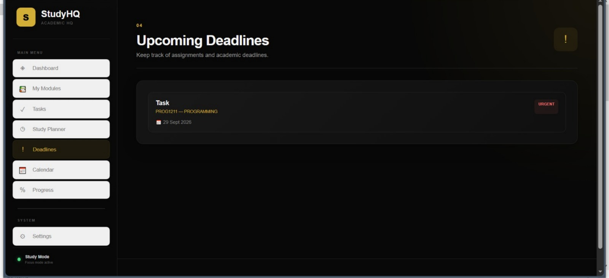
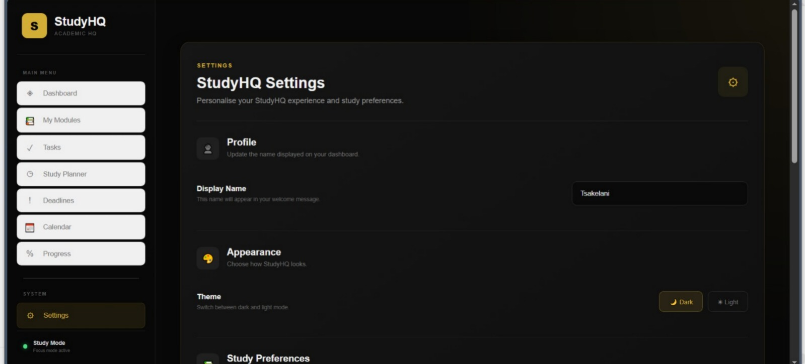

# StudyHQ 📚💻

> A student-focused academic organisation and study management platform.

## 📖 About StudyHQ

StudyHQ is a web-based platform designed to help students organise and manage their academic responsibilities in one centralised space.

The platform provides students with a simple and structured way to keep track of their academic workload, including modules, tasks, deadlines and study sessions.

StudyHQ is a personal software development project created and developed by **Tsakelani Ngobeni**.

## ✨ Features

- 📊 Academic dashboard
- 📚 Module management
- ✅ Task management
- 📅 Deadline management
- ⏱️ Study session management
- ⚙️ Settings
- 🧭 Simple navigation
- 📱 Student-focused interface

## 🛠️ Technologies

StudyHQ is currently built using:

- HTML
- CSS
- JavaScript

## 🌐 Live Prototype

**Visit StudyHQ:**  
https://tsakelaningobeni2-wq.github.io/StudyHQ/

## 🎯 Project Goal

The goal of StudyHQ is to create a centralised digital study environment that makes it easier for students to organise their academic responsibilities and maintain an overview of their workload.

## 🚀 Current Version

**StudyHQ v1.0 — Initial Public Release**

This version represents the first publicly accessible version of StudyHQ.

## 🔮 Future Development

Future versions of StudyHQ may introduce additional functionality, usability improvements and features based on user feedback.

The project will continue to be developed and refined as part of my software development journey.

## 👨🏽‍💻 Developer

**Tsakelani Ngobeni**

Software Development Student

StudyHQ is a personal project created to develop practical software-development skills and explore the process of designing, developing and maintaining a real-world web application.

## 📸 Screenshots

### 🏠 Dashboard

The StudyHQ dashboard provides students with an overview of their academic workspace and key study information.

### 📚 Modules

The Modules section allows students to organise and manage their academic modules.

### ✅ Tasks

The Tasks section helps students keep track of academic tasks and responsibilities.

### 📅 Deadlines

The Deadlines section provides students with a clear view of upcoming academic deadlines.

### ⚙️ Settings

The Settings section allows users to manage their StudyHQ preferences and configuration.

---

**Still becoming. Still building.** 🖤
